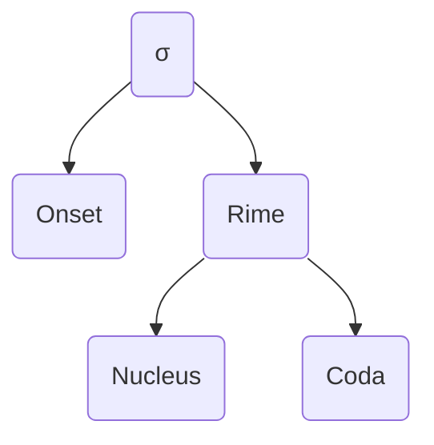
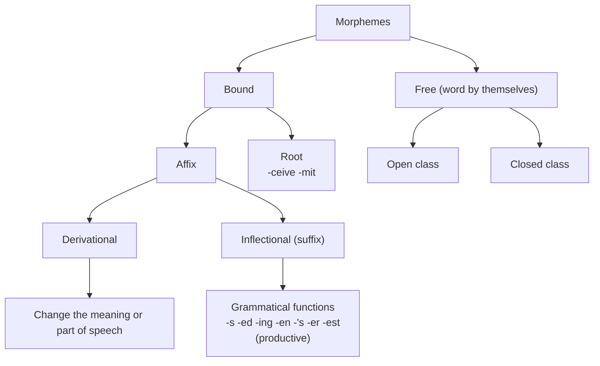
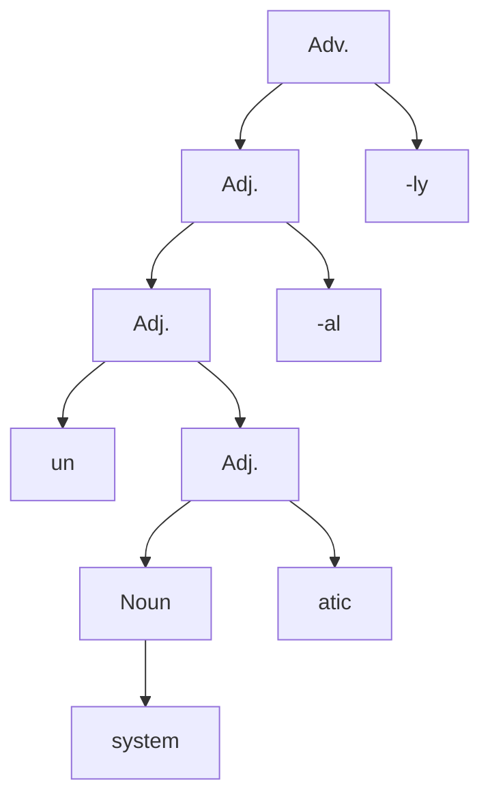

## 1. Intro
#### Hockett's  design features of human L
- Vocal - auditory channel
	- Counterexample : written L, sign L
- Arbitrariness
	- Relationship is conventional
	- Counterexample : Onomatopoeia(의성어), Sound symbolism(vowel [i] means small)
- Productivity
- Duality of patterning
	- Many words from small number of sounds
- Displacement
	- Communication of not present time/space
### Modalities
1. Auditory - vocal (spoken L)
2. Visual - gestural (signed L)
- Writing : L is NOT writing systems
	- secondary
	- must be taught
	- do not exist everywhere (some L do not have it)
### Signed L
- main L for deaf community
- no universal sign L (ASL / BSL / KSL …)
- not simply a manual version of spoken L
- same degree of structural complexity and expressive power as spoken L
- signs are made up of a set of small components
	- hand shapes, locations, movements, orientation
- Evidence of all L are governed by the same universal properties
	1. Form - meaning arbitrary (not completely iconic)
	2. Deaf children acquire with same development steps
	3. Same area in brain used + visual-spatial processing
### L and thought
- Sapir-Whorf hypothesis
	- Linguistic determinism
		- L determines how we perceive
		- ex. Pirahã (one-two-many system of counting)
		- ex. Hopi Indians (no grammatical tense, sophisticated concept of time)
	- Linguistic relativism
		- different L → different way of thinking
- Current research : L do NOT determine how we think
## 2. Phonetics
### Vocal tract
![[Vocal tract.png]]
- Voiced : vocal folds vibrate (↔ Voiceless)
- Vocal tract above larynx acts as filter
- IPA (International Phonetic Alphabet)
### Vowel
- airflow is not impeded
- usually voiced
- Vowel height, Backness, Lip rounding
- Diphthongs : vowel that quality changes (↔ Monophthongs)
![[Vowels.png]]
- Cardinal vowels (language-independent reference)
	- Primary : [i], [e], [ɛ], [a], [ɑ], [ɔ], [o], [u]
	- Secondary : different lip rounding
### Consonant
- Obstruction
- VPM labels (Voice, Place, Manner)
![[Consonants.png]]
![[Consonant Place.png]]
- Manner
	- Plosives (stops) : air flow stopped
	- Nasal : nasal airflow (velum is lowered)
	- Fricative : partially obstructed (narrow slit → noise)
	- Affricate : closure → noisy
	- Approximant : active to passive articulator
		- Central [j], [w] (glides, semivowels), [ɹ]
		- Lateral [l]
- Consonants of world's L
	- Uvular: made by raising the back of the tongue toward the uvula
	- Tap: a tap [ɾ] is similar to [d]
	- Trill: a trill consists of a series of very rapid 'tap-like' closures between the active and the passive articulator
### Suprasegmental features
- Length (ex. Finnish, Danish)
- Tone (Pitch change) (ex. Mandarin, Thai, Vietnamese)
- Stress
	- "Stressed" → longer, louder, higher pitch
	- "Unstressed" → vowel becomes schwa \[ə\] (EN)
	- Variable words stress (EN, German)
	- Fixed word stress (Czech, Polish, Swaihili)
- Intonation
	- pattern of pitch movements over an utterance
	- conveys affective stance / attitude / sentence types
	- highlight / disambiguate sentences
## 3. Phonology
### Phonology
- Phonology : the study of how speech sounds from patterns
- Phoneme(음소) : abstract basic form that distinguishes one word from another
- Minimal pair(최소 대립쌍) : 하나의 phoneme만 다른 쌍
- /phoneme/ \[allophones or phones\]
- Morpheme(형태소) : the minimal unit of meaning
- Morphophonemic rules : rules determines phonetic forms of morphemes
### Morphophonemic Rule Example
1. English Plural /z/
	- after V+ non-sibilant : [z]
	- after V- non-sibilant : [s]
	- after sibilant : [əz]
	- Allomorph : a variant of morpheme ([z], [s], [əz])
	- Sibilant : hissing sounds (fricatives, affricates)
		- Ex. [s], [ʃ], [z], [ʒ], [tʃ], [dʒ]
	- Rule
		1. Insert [ə] if noun ends with sibilant
		2. Change /z/ to [s] if preceded by V- sound
2. English past tense /d/
	1. Insert [ə] if ends with alveolar stop ([t] [d])
	2. Change /d/ to [t] if V- sound precedes
### Allophonic variations
- Allophone : 2+ sounds that are variants of same phoneme
- Rule-governed, nondistinctive feature (predictable)
- Phonetically similar, cross-linguistic differences
- Examples
	1. Aspirated V- stop [p], [t], [k]
		- syllable-initial, before stressed vowel [pʰɪl], [tʰɪl]
		- after syllable-initial /s/ : [spɪl], [stɪl]
		- /t/ has one more allophones [ɾ] : [bɪɾər]
			- between stressed V and unstressed V
	1. Vowel nasalization : before nasal consonants
		- Ex. bean [bĩːn]
		- Nasality is distinctive in other L (Akan, Portuguese)
### Natural class of speech sounds
![[Natural Class of Sounds.png]]
- Obstruent : stops / fricatives / affricates
- Sonorant : not obstruent
- Syllabic : can be a nucleus of syllables (Nasals/Liquids can be syllabic due to schwa [ə])
### Phonological Rules (P-rules)
- Assimilation rules
	- coarticulation, ease of articulation
	- Ex. Vowel nasalization : V → [+nasal] / _ [+nasal] \$
	- Ex. Voicing assimilation : /kæt+z/ → [kæts]
	- Ex. Place assimiliation : 'in-'
		- Bilabial : impossible [ɪm pɒsəbəl]
		- Alveolar : intolerant [ɪn tɒlərənt]
		- Velar : incongruous [ɪŋ kɒngruəs]
- Dissimilation rules
	- easier to articulate dissimilar sounds
	- '-al', '-ar' : whether noun contains /l/
	- annu-al / angul-ar
- Segment insertion rules (epenthesis)
	- Ex. Ø → ə / [+sibilant] __ [+sibilant]
- Segment deletion rules
	- Ex. myst*e*ry, mem*o*ry
	- Ex. Delete /g/
		- word initially before nasal consonant (gnostic [nastɪk])
		- before a syllable-final nasal consonant (design [dəzãɪn])
- Many → one
	- Ex. English schwa rule (unstressed vowel
	- /i/ /ɪ/ /e/ /ɛ/ /æ/ /a/ /o/ → [ə]
- One → many
	- German word-final devoicing
		- bund /bʊnd/ [bʊnt]
### Syllable structure

### Phonotactic constaints
- Rules about permissible sequence of sounds
- Cross-linguistic differeces
	- Ex. KR syllable (C)V(C) : [kap̚] (unreleased stop)
- Delete C or add V to fit syllable structure when borrowing foreign word
	- Ex. glass → lasi (Finnish), control → [kontoɾoːɾɯ] (Japanese)
- Accidental gaps, lexical gaps : possible words that obeying constraints
- Some P-rules for obeying constraints
	- Obstruct devoicing : reaped [riːpt], peaked [piːkt]
	- Schwa insertion (for not permitted sequences)
		- [kk], [kg], [gk], [gg], [pp], [sz], [zs]
		- mended [mɛ̃ndəd], vented [vɛ̃ntəd]
- Sonority sequencing principle (EN)
	- "Sonority scale" : obstruent - nasal - liquid - glide - vowels(highest)
	- Nucleus is a peak of the sonority
- Obligatory vs Optional
	- Obligatory : vowel nasalization, aspiration (EN)
	- Optional
		- /h/ deletion : her /həɹ/ [əɹ] (EN)
		- 문법 /mun.pʌp/ [mum.pʌp] (KR)
- Foreign accent
	- When applying constraint/P-rules of own language for non-native speakers
	- Ex. student [ɛstudɛnt] (Spanish), Big Mac [bɪŋ mæk] (KR)
## 4. Morphology
### Morphology
- Morphology : structure of words & rules for word formation
- Mental lexicon (Mental dictionary)
	- Pronunciation, meaning, orthography(spelling), grammatical category
- Content vs Function
	- Content words : Noun. Verb. Adj. Adv. - Open class words
	- Function words : Pronoun. Articles. Prep. Conj. Aux verb. - Closed class words
- Discreteness
	- feature of L
	- combine units (sounds - morphemes - words - sentences)
### Morphemes
- Morpheme : the minimal unit of meaning
- Infixes (Ex. -um-)
- Circumfixes (Ex. ik- + -o)

### Hierarchical structure of words
- Fixed order hierarchy, disambiguate

- Rule productivity
	- Productive : -able, -un, -er
	- Less productive : -ity, -th, -en
	- Really rare : -let, -ling (diminutive suffix)
- Suppletion
	- irregular forms (must be learned separately)
	- Ex. sheep, children, went, better
### Word formation processes
1. Back-formation
	- created by misanalysis
	- Ex. pease → pea (plural)
	- Ex. editor → edit ('-er' means person)
	- Ex. television → televiese ('-tion' for nouns)
	- Ex. bikini → monokini ('bi-' means two)
2. Compounds
	- 2+ words joined, very common
	- last word called head; grammatical category
	- stress in first word
	- Ex. girlfriend, undergo, pickpocket
3. Acronyms (NATO, KAIST, ASAP)
4. Blends (brunch = breakfast + lunch, 라볶이 = 라면 + 떡볶이)
5. Conversion : 여러 품사로 사용 (run, buy, steal, ...)
6. Eponyms : word based on names (google, Kleenex, watt)